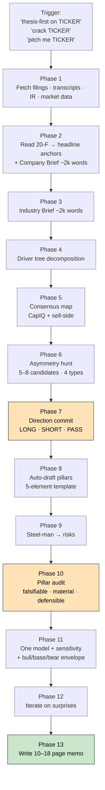

# equity-research

[](LICENSE)
[](https://claude.com/claude-code)
[](https://agentskills.io)

> **Crack a single stock for an investment view — thesis-first, not research-then-thesis.** A 13-phase Claude Code skill that walks you from raw filings to a defensible 10–18 page investment memo: business understanding → industry → driver decomposition → consensus map → asymmetry hunt → direction commit → pillars → steel-man → audit → model with sensitivity → write-up. Every phase boundary is a checkpoint you control — the skill never auto-advances.

## Why this exists

Most equity-research tooling has the order backwards. It builds the model first, then retrofits a thesis to the numbers. By the time the analyst commits a direction, the model has done the thinking for them — and the thesis is whatever the model implies, dressed up.

Good analysts work the other way. They understand the business, scan where Street consensus is stretched, form a direction with reasons, *then* build the model to express the view. The model is the test, not the source.

This skill enforces that order:

- **Thesis-first ordering.** Direction commits at Phase 7, before any model is built. Phases 1–6 build the foundation (filings, business, industry, drivers, consensus, asymmetries) without picking a side. Phases 8–13 develop pillars, steel-man, audit, model, and write — *for the committed direction*.
- **Asymmetry hunt is the engine.** Four asymmetry types — disclosure-thin, recent inflection, framework miss, behavioural mistake — surfaced from primary documents with verbatim evidence. A pillar without an asymmetry is just consensus repackaged. The skill has explicit anti-patterns coded in (e.g., "majority vs outlier mistaken for asymmetry," "fake precision in bps decomposition") that catch the most common failure modes.
- **Killing conditions are written before publication.** Phase 10 forces every pillar to have a pre-specified event or number that would prove it wrong. The final memo includes a verbatim "What would change my mind" section — the interview question every PM eventually asks.
- **One model, three target prices.** Phase 11 builds a single 3-statement + DCF expressing the committed direction. Bull and bear are the *payoff envelope around the base*, computed from the same model by flexing the top tornado swing assumptions. No three parallel scenarios; explicit risk/reward skew.
- **Q&A interludes are mandatory.** Every phase boundary pauses for you to interrogate, edit, kill, or sharpen the output. Default is wait, never auto-continue. The heaviest pauses are Phases 2, 3, 7, 8, 9, 10, 12.

It's designed for someone who needs to form a real view on a single name — recruiting prep, personal research, getting smart on a coverage candidate — not full sell-side report production.

## What you get

After running the workflow end-to-end on one ticker:

```
~/Claude Projects/Equity Research/[TICKER]/
├── filings/               # 3yr 10-Ks · 4Q 10-Qs · 2 proxies — fetched by skill
├── transcripts/           # last 4 earnings transcripts — fetched by skill
├── ir-materials/          # investor day deck · 10-K language diff — fetched by skill
├── sell-side/             # YOU populate from CapIQ / Bloomberg / FactSet
├── extractions/           # Phase 2 structured 20-F + headline anchors
├── working/               # one .md per phase output
│   ├── context.md           (Phase 1 raw fetches)
│   ├── company_brief.md     (Phase 2 — ~1,500–2,000 words)
│   ├── industry_brief.md    (Phase 3 — ~1,500–2,000 words)
│   ├── driver_tree.md       (Phase 4)
│   ├── consensus_map.md     (Phase 5)
│   ├── asymmetries.md       (Phase 6 — 5–8 candidates)
│   ├── direction_brief.md   (Phase 7 + commit)
│   ├── pillars.md           (Phase 8)
│   ├── risks.md             (Phase 9 steel-man → risk list)
│   ├── killing_conditions.md (Phase 10)
│   └── model_summary.md     (Phase 11 — base + bull/bear envelope + tornado)
└── deliverables/
    ├── [ticker]_model.xlsx  (3-statement + DCF + sensitivities + tornado)
    └── [ticker]_memo.md     (10–18 pages; Section 1 is the verbal-pitchable 1-page summary)
```

Section 1 of the memo is itself a recruiting-grade verbal pitch: rating · target · base/bull/bear envelope with risk-reward skew · pillars one-liners · key risks · catalysts · "what would change my mind" teaser.

## How it works



The amber boxes are the load-bearing judgement moments — direction commit and pillar audit. The skill drafts; you commit. Every phase boundary pauses for Q&A.

### What the skill does vs what you do

| Skill does | You do |
|---|---|
| Fetching, downloading, parsing | Forming views |
| Decomposing drivers into trees | Killing weak pillars |
| Mapping consensus from sources | Committing direction |
| Drafting candidate pillars | Critiquing drafts |
| Drafting candidate killing conditions | Verifying killing conditions |
| Computing materiality, sensitivity, tornado | Accepting/rejecting flags |
| Flagging weak pillars | Deciding what survives |

The view is always yours. The skill surfaces evidence, drafts, computes, and flags — it never picks a direction or grades pillar quality.

## Install

```bash
git clone https://github.com/GeniusTrader-Harry/equity-research-skill.git \
  ~/.claude/skills/equity-research-customised-process
```

In Claude Code, the skill auto-loads when it detects relevant phrasing. Trigger phrases:

- *"thesis-first on [TICKER]"*
- *"crack [TICKER]"*
- *"pitch me [TICKER]"*
- *"research [TICKER] for an interview"*
- *"form a view on [TICKER]"*

Or invoke explicitly via `/equity-research`.

### Prerequisites

- Claude Code 2.x
- `curl` for filings fetch
- `pdftotext` (poppler) for PDF parsing
  - macOS: `brew install poppler`
- Recommended: a [Claude in Chrome](https://claude.com/claude-in-chrome) extension or local Chrome for IR-site fetches that hit anti-bot 403s under naïve curl

### Source documents you supply

The skill fetches filings and transcripts programmatically from SEC EDGAR + IR sites. **Sell-side notes are user-fetched** because providers (CapIQ / Bloomberg / FactSet) prohibit scraping. The skill pauses in Phase 1 with instructions for what to download into `sell-side/` — recent initiations, regular updates, industry primer — and ingests whatever you provide on "done." If you skip, it falls back to aggregator data (Yahoo / Seeking Alpha / Substack) and flags the degraded coverage.

## Customisation

Most of the skill is opinionated by design (anti-patterns coded into Phases 6 and 8 catch known failure modes), but several pieces are tunable:

| What | Where |
|---|---|
| Memo length / pitch style | [references/phase13-pitch-template.md](references/phase13-pitch-template.md) |
| Asymmetry types and anti-patterns | [references/phase6-asymmetry-hunt.md](references/phase6-asymmetry-hunt.md) |
| Driver-tree templates by sector | [references/phase4-driver-trees.md](references/phase4-driver-trees.md) |
| Source hierarchy for actuals vs consensus | [SKILL.md](SKILL.md) and [references/phase1-context-load.md](references/phase1-context-load.md) |
| Currency convention for foreign private issuers | [references/phase11-model-build.md](references/phase11-model-build.md) |
| Q&A pause behaviour | [SKILL.md](SKILL.md) Principle 2 |

The 5-element pillar template (claim · driver · mechanism · magnitude · timeframe) is hard-coded — it's the discipline the whole workflow protects.

## Anti-patterns the skill catches

These are encoded into the spec because they're the most common failure modes the skill has surfaced through real runs:

- **NEVER fabricate figures.** Every numeric claim has an inline citation: `[source p.N]`, `[source]`, or `[est, not disclosed]`. No bare numbers.
- **No fake precision.** Don't attach a page number or take rate to a claim unless you've verified it during this session. *Plausible* precision is a worse failure than admitted vagueness.
- **Source-fallback rule.** When the first-choice source doesn't have a needed data point, fall back to the next layer — never skip and silently corrupt comparisons.
- **Majority vs outlier mistaken for asymmetry.** Disagreeing with one outlier analyst while agreeing with the Street majority is not edge — it's consensus.
- **Promoting an asymmetry without primary-data backing.** Two analysts disagreeing is sell-side dispersion, not edge. Run a light-touch primary-data scan (transcripts, filings) before promoting.
- **Fake bps decomposition.** Most published margin "bridges" are analyst opinion with chart labels, not auditable builds. Cite, but note the magnitudes are estimates without verifiable methodology.

## A note on what this is NOT

- **NOT a replacement for a real sell-side report.** Sell-side initiations are 50–100 pages and serve a different purpose (broad coverage; institutional client coverage). This skill produces 10–18 pages with thesis depth.
- **NOT an earnings-update workflow.** For post-print analysis on a name you already cover, use a lighter workflow.
- **NOT a sector primer.** For sector-level work, use a separate sector-overview skill.
- **NOT automated investing.** The skill produces a defensible view; the trade is your call. No automated execution, no real-money decisions.

## Acknowledgements

Built from iterative stress-testing on real names (Spotify, NVIDIA, others). The 13-phase ordering, the asymmetry types, the killing-condition discipline, and the anti-patterns above all came out of real failure modes the skill caught (or missed and was patched against) during those runs.

Mistakes are mine. Patches welcome.

## License

[MIT](LICENSE).
